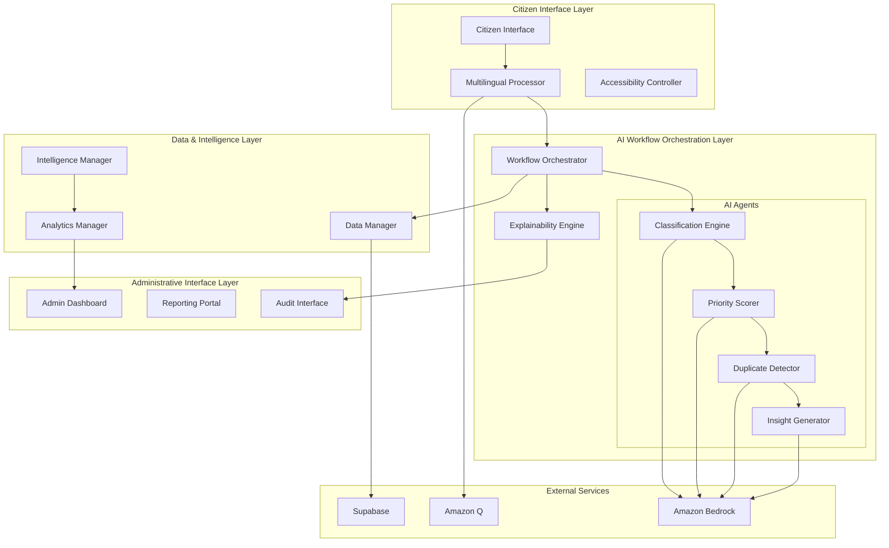

# Design Document: CivicSense AI-Powered Civic Issue Intelligence System

## Overview

CivicSense transforms fragmented civic issue reporting in Indian urban and semi-urban communities into actionable intelligence through AI-powered classification, prioritization, duplicate detection, and insight generation. The system addresses critical gaps in municipal response efficiency by providing transparent, multilingual, and scalable civic intelligence capabilities.

The design leverages a multi-agent AI orchestration approach where specialized AI agents collaborate to process citizen complaints through sequential workflows. Each agent focuses on a specific intelligence task (classification, prioritization, duplicate detection, insight generation) while maintaining transparency and explainability throughout the process.

Key architectural principles include citizen-first design, AI transparency, multilingual accessibility, and cloud-native scalability to serve diverse Indian urban communities effectively.

## Architecture

### High-Level Architecture



### Multi-Agent Orchestration Pattern

The system implements a **sequential processing pattern** with **planner-critic feedback loops** for AI workflow orchestration:

1. **Sequential Processing**: Each submitted issue flows through specialized agents in a defined sequence
2. **Specialized Agents**: Each agent excels at a specific intelligence task with clear boundaries
3. **Orchestrated Coordination**: A central orchestrator manages agent execution, state, and error handling
4. **Feedback Loops**: Agents can request clarification or additional processing when confidence is low

This approach ensures reliable, transparent, and auditable AI decision-making suitable for civic governance applications.

## Components and Interfaces

### Core Components

#### 1. Workflow Orchestrator
**Purpose**: Coordinates AI agent execution and maintains workflow state
**Key Responsibilities**:
- Manages sequential agent execution for each civic issue
- Handles agent failures and retry logic
- Maintains execution state for workflow resumption
- Logs all agent interactions for audit purposes
- Supports workflow customization per city requirements

**Interface**:
```typescript
interface WorkflowOrchestrator {
  processIssue(issue: CivicIssue): Promise<ProcessedIssue>
  retryFailedAgent(workflowId: string, agentType: AgentType): Promise<void>
  getWorkflowStatus(workflowId: string): WorkflowStatus
  customizeWorkflow(cityId: string, config: WorkflowConfig): void
}
```

#### 2. Classification Engine
**Purpose**: Categorizes civic issues into predefined domains using AI
**Key Responsibilities**:
- Analyzes natural language complaints for domain classification
- Assigns confidence scores to classification decisions
- Supports 15+ civic domains (roads, water, sanitation, electricity, public safety, etc.)
- Flags low-confidence classifications for manual review

**Interface**:
```typescript
interface ClassificationEngine {
  classifyIssue(complaint: string, metadata: IssueMetadata): Promise<Classification>
  getSupportedDomains(cityId: string): Domain[]
  updateClassificationModel(trainingData: ClassificationData[]): Promise<void>
}

interface Classification {
  domain: Domain
  confidence: number
  reasoning: string
  alternativeDomains: Domain[]
}
```

#### 3. Priority Scorer
**Purpose**: Assigns severity and urgency ratings to classified issues
**Key Responsibilities**:
- Evaluates public safety impact, affected population, and infrastructure criticality
- Assigns severity ratings (1-5) and urgency ratings (1-5)
- Flags high-priority issues (4-5 rating) for immediate escalation
- Provides transparent reasoning for priority decisions

**Interface**:
```typescript
interface PriorityScorer {
  scorePriority(issue: ClassifiedIssue): Promise<PriorityScore>
  updatePriorityWeights(cityId: string, weights: PriorityWeights): void
}

interface PriorityScore {
  severity: number // 1-5
  urgency: number // 1-5
  overallPriority: number // calculated composite
  reasoning: string
  escalationRequired: boolean
}
```

#### 4. Duplicate Detector
**Purpose**: Identifies similar and duplicate issue reports
**Key Responsibilities**:
- Compares new issues against existing reports using similarity algorithms
- Calculates similarity scores considering location, type, and temporal factors
- Links related reports and updates affected citizen counts
- Maintains similarity thresholds (>0.7 for duplicates)

**Interface**:
```typescript
interface DuplicateDetector {
  findSimilarIssues(issue: ClassifiedIssue): Promise<SimilarityResult[]>
  linkDuplicateIssues(primaryId: string, duplicateIds: string[]): Promise<void>
  updateSimilarityThresholds(cityId: string, thresholds: SimilarityThresholds): void
}

interface SimilarityResult {
  issueId: string
  similarityScore: number
  similarityFactors: string[]
  isDuplicate: boolean
}
```

#### 5. Insight Generator
**Purpose**: Produces analytical summaries and trend insights
**Key Responsibilities**:
- Generates weekly summary reports of issue trends
- Identifies emerging problem areas and seasonal patterns
- Calculates resolution time metrics and bottleneck analysis
- Provides comparative analysis across city areas and demographics

**Interface**:
```typescript
interface InsightGenerator {
  generateWeeklyReport(cityId: string, dateRange: DateRange): Promise<WeeklyReport>
  identifyEmergingIssues(cityId: string): Promise<EmergingIssue[]>
  analyzeResolutionMetrics(cityId: string, filters: AnalysisFilters): Promise<ResolutionMetrics>
  compareAreas(cityId: string, areas: string[]): Promise<AreaComparison>
}
```

#### 6. Explainability Engine
**Purpose**: Provides transparent reasoning for all AI decisions
**Key Responsibilities**:
- Generates human-readable explanations for AI decisions
- Maintains decision audit trails with cited factors
- Provides multilingual explanations in citizen's preferred language
- Communicates uncertainty when AI confidence is low

**Interface**:
```typescript
interface ExplainabilityEngine {
  explainClassification(classification: Classification, language: string): Promise<Explanation>
  explainPriority(priorityScore: PriorityScore, language: string): Promise<Explanation>
  explainSimilarity(similarity: SimilarityResult, language: string): Promise<Explanation>
  getDecisionAuditTrail(issueId: string): Promise<AuditTrail>
}
```

### Data Layer Components

#### 7. Multilingual Processor
**Purpose**: Handles multilingual input processing and language detection
**Key Responsibilities**:
- Supports Hindi, English, and 5+ major Indian regional languages
- Performs language detection and validation
- Maintains language preferences for registered citizens
- Provides equivalent processing accuracy across languages

**Interface**:
```typescript
interface MultilingualProcessor {
  detectLanguage(text: string): Promise<LanguageDetection>
  processMultilingualInput(input: string, detectedLanguage: string): Promise<ProcessedInput>
  translateForProcessing(text: string, targetLanguage: string): Promise<string>
  formatResponse(response: string, targetLanguage: string): Promise<string>
}
```

#### 8. Data Manager
**Purpose**: Manages civic issue data storage, retrieval, and privacy
**Key Responsibilities**:
- Handles CRUD operations for civic issues and related data
- Implements data encryption and privacy controls
- Manages multi-city data isolation
- Supports data retention and deletion policies

**Interface**:
```typescript
interface DataManager {
  storeIssue(issue: CivicIssue): Promise<string>
  retrieveIssue(issueId: string): Promise<CivicIssue>
  updateIssueStatus(issueId: string, status: IssueStatus): Promise<void>
  deletePersonalData(citizenId: string): Promise<void>
  queryIssues(filters: IssueFilters): Promise<CivicIssue[]>
}
```

## Data Models

### Core Data Structures

#### CivicIssue
```typescript
interface CivicIssue {
  id: string
  citizenId?: string // Optional for anonymous reporting
  complaint: string
  language: string
  location?: GeoLocation
  timestamp: Date
  attachments?: Attachment[]
  
  // AI Processing Results
  classification?: Classification
  priorityScore?: PriorityScore
  similarIssues?: string[]
  
  // Status Tracking
  status: IssueStatus
  assignedDepartment?: string
  resolutionDate?: Date
  
  // Audit Trail
  workflowId: string
  processingLog: ProcessingStep[]
}
```

#### ProcessingStep
```typescript
interface ProcessingStep {
  agentType: AgentType
  timestamp: Date
  input: any
  output: any
  confidence: number
  reasoning: string
  executionTime: number
  success: boolean
  errorMessage?: string
}
```

#### WorkflowConfig
```typescript
interface WorkflowConfig {
  cityId: string
  enabledAgents: AgentType[]
  sequenceOrder: AgentType[]
  confidenceThresholds: Record<AgentType, number>
  escalationRules: EscalationRule[]
  customDomains: Domain[]
}
```

### Analytics Data Models

#### WeeklyReport
```typescript
interface WeeklyReport {
  cityId: string
  reportPeriod: DateRange
  totalIssues: number
  issuesByDomain: Record<string, number>
  priorityDistribution: Record<number, number>
  resolutionMetrics: ResolutionMetrics
  emergingTrends: Trend[]
  recommendations: string[]
}
```

#### EmergingIssue
```typescript
interface EmergingIssue {
  domain: string
  location: GeoLocation
  issueCount: number
  growthRate: number
  severity: number
  description: string
  recommendedActions: string[]
}
```
## Correctness Properties

*A property is a characteristic or behavior that should hold true across all valid executions of a system—essentially, a formal statement about what the system should do. Properties serve as the bridge between human-readable specifications and machine-verifiable correctness guarantees.*

### Property 1: Natural Language Processing Acceptance
*For any* natural language civic complaint submitted by a citizen, the CivicSense should accept and process the submission successfully, generating a unique tracking identifier and audit log entry.
**Validates: Requirements 1.1, 1.3, 1.5**

### Property 2: AI Classification Completeness
*For any* submitted civic issue, the Classification Engine should categorize it into a valid civic domain with a confidence score between 0 and 1, and provide human-readable reasoning for the decision.
**Validates: Requirements 2.1, 2.2, 2.5**

### Property 3: Priority Scoring Consistency
*For any* classified civic issue, the Priority Scorer should assign both severity and urgency ratings within the range 1-5, and flag issues with ratings of 4 or 5 for immediate escalation.
**Validates: Requirements 3.1, 3.2, 3.5**

### Property 4: Duplicate Detection and Linking
*For any* new civic issue submission, the Duplicate Detector should compare it against existing reports and, when similarity scores exceed 0.7, properly link the related reports and update affected citizen counts.
**Validates: Requirements 4.1, 4.2, 4.3**

### Property 5: Multilingual Processing Consistency
*For any* civic complaint submitted in a supported Indian language, the system should process it with equivalent accuracy to English submissions and provide all responses in the same language as the original submission.
**Validates: Requirements 5.2, 5.3, 5.5**

### Property 6: AI Explainability Completeness
*For any* AI decision made by the system (classification, prioritization, duplicate detection), the Explainability Engine should provide human-readable reasoning that cites specific factors influencing the decision and maintains an immutable audit trail.
**Validates: Requirements 7.1, 7.2, 7.4**

### Property 7: Comprehensive Audit Logging
*For any* AI agent execution or manual override, the system should log all required information including timestamps, inputs, outputs, confidence scores, and administrator identity (for overrides) in searchable, immutable audit trails.
**Validates: Requirements 8.1, 8.2, 8.3, 8.4**

### Property 8: Real-time Analytics and Visualization
*For any* civic issue data in the system, administrators should be able to access real-time dashboards showing issue distributions, AI performance metrics, and geographic heat maps with drill-down capabilities to individual issue details.
**Validates: Requirements 9.1, 9.2, 9.3, 9.5**

### Property 9: Multi-City Data Isolation
*For any* municipal jurisdiction using the system, their civic issue data should remain completely isolated from other cities while still supporting federated analytics that preserve privacy between jurisdictions.
**Validates: Requirements 10.1, 10.5**

### Property 10: Graceful Degradation Under Failure
*For any* system component failure, the CivicSense should continue accepting citizen submissions in degraded mode and queue them for processing when services are restored, while providing accurate status indicators.
**Validates: Requirements 11.2, 11.4, 11.5**

### Property 11: Data Privacy and Access Control
*For any* citizen data in the system, it should be encrypted both in transit and at rest, with role-based access controls ensuring only authorized personnel can access it, and support complete personal data deletion while preserving anonymized analytics data.
**Validates: Requirements 12.1, 12.2, 12.3**

### Property 12: Workflow Orchestration Reliability
*For any* submitted civic issue, the Workflow Orchestrator should execute AI agents in the defined sequence, handle agent failures through retry logic and escalation, maintain execution state for resumption after interruptions, and log all agent interactions.
**Validates: Requirements 14.1, 14.2, 14.3, 14.4**

### Property 13: Incomplete Information Handling
*For any* civic complaint with missing essential information, the system should prompt for required details without rejecting the submission, maintaining the original complaint data.
**Validates: Requirements 1.2**

### Property 14: Low Confidence Decision Handling
*For any* AI decision with confidence below the configured threshold, the system should flag the decision for manual review and clearly communicate uncertainty to users.
**Validates: Requirements 2.3, 7.5**

### Property 15: Contextual Help and Guidance
*For any* citizen requesting assistance while using the system, contextual help and guidance should be provided appropriate to their current interaction context.
**Validates: Requirements 13.3**

### Property 16: Insight Generation and Pattern Detection
*For any* collection of civic issues over time, the Insight Generator should identify emerging problem areas based on frequency and severity patterns, detect seasonal trends, and calculate accurate resolution time metrics.
**Validates: Requirements 6.2, 6.3, 6.4**

### Property 17: City-Specific Configuration
*For any* city using the system, administrators should be able to configure city-specific issue categories, priority weights, and workflow rules that are applied consistently to all issues processed for that jurisdiction.
**Validates: Requirements 10.2**

### Property 18: Language Detection and Confirmation
*For any* submission where language detection is uncertain, the system should prompt the citizen for language confirmation and process the submission accordingly once confirmed.
**Validates: Requirements 5.4**

### Property 19: High-Load Performance Maintenance
*For any* period of high system load, the CivicSense should maintain acceptable response times through intelligent queuing and resource scaling mechanisms.
**Validates: Requirements 15.5**

### Property 20: AI Model Performance Consistency
*For any* city deployment of the system, AI model performance should remain consistent across different municipal jurisdictions, ensuring equitable service quality.
**Validates: Requirements 10.4**

## Error Handling

### Error Classification and Response Strategy

The system implements a multi-layered error handling approach designed for civic governance reliability:

#### 1. Input Validation Errors
- **Malformed Submissions**: Accept and prompt for clarification rather than rejection
- **Unsupported Languages**: Gracefully degrade to supported language options
- **Missing Location Data**: Request clarification while preserving complaint content
- **Oversized Attachments**: Compress or request alternative submission methods

#### 2. AI Processing Errors
- **Low Confidence Classifications**: Flag for manual review with explanation
- **Agent Execution Failures**: Implement exponential backoff retry with escalation
- **Model Unavailability**: Queue submissions for processing when services restore
- **Timeout Errors**: Provide partial results with status indicators

#### 3. System Infrastructure Errors
- **Database Connectivity**: Implement read replicas and graceful degradation
- **External Service Failures**: Cache responses and provide offline capabilities
- **Network Partitions**: Maintain local processing with eventual consistency
- **Resource Exhaustion**: Implement intelligent queuing and load shedding

#### 4. Data Privacy and Security Errors
- **Unauthorized Access Attempts**: Log, block, and alert administrators
- **Data Corruption**: Implement checksums and automatic recovery
- **Encryption Failures**: Fail secure with immediate escalation
- **Audit Trail Tampering**: Immutable logging with cryptographic verification

### Error Recovery Mechanisms

#### Workflow State Recovery
- Persistent workflow state enables resumption after interruptions
- Idempotent operations prevent duplicate processing during recovery
- Checkpoint-based recovery minimizes reprocessing overhead

#### Data Consistency Guarantees
- ACID transactions for critical civic issue data operations
- Eventually consistent analytics with conflict resolution
- Backup and restore procedures with point-in-time recovery

## Testing Strategy

### Dual Testing Approach

The CivicSense system requires both unit testing and property-based testing to ensure comprehensive coverage suitable for civic governance applications:

#### Unit Testing Focus
- **Specific Examples**: Test concrete scenarios like "pothole report in Hindi gets classified as 'Roads' domain"
- **Edge Cases**: Test boundary conditions like exactly 2000 character submissions, empty location data
- **Integration Points**: Test API contracts between AI agents and external services (Amazon Bedrock, Supabase)
- **Error Conditions**: Test specific failure scenarios like network timeouts, invalid API responses
- **Accessibility Features**: Test voice input processing, screen reader compatibility

#### Property-Based Testing Focus
- **Universal Properties**: Test properties that must hold across all possible inputs
- **Comprehensive Input Coverage**: Generate thousands of random civic complaints in multiple languages
- **AI Decision Consistency**: Verify that similar complaints receive similar classifications and priorities
- **Data Integrity**: Ensure audit trails are complete and immutable across all operations
- **Multilingual Equivalence**: Verify processing accuracy is consistent across all supported languages

### Property-Based Testing Configuration

**Testing Framework**: Use **fast-check** for TypeScript/JavaScript property-based testing
**Test Iterations**: Minimum 100 iterations per property test to ensure statistical confidence
**Test Tagging**: Each property test must reference its design document property using the format:
```typescript
// Feature: civic-issue-intelligence, Property 1: Natural Language Processing Acceptance
```

### Testing Implementation Strategy

#### AI Agent Testing
- **Classification Engine**: Property tests for domain categorization consistency
- **Priority Scorer**: Property tests for rating range compliance and escalation triggers  
- **Duplicate Detector**: Property tests for similarity score accuracy and linking behavior
- **Insight Generator**: Property tests for trend detection and metric calculation accuracy

#### Workflow Orchestration Testing
- **Sequential Execution**: Property tests for correct agent execution order
- **Failure Recovery**: Property tests for retry logic and state persistence
- **Multi-City Isolation**: Property tests for data privacy between jurisdictions

#### Performance and Scalability Testing
- **Load Testing**: Verify 1000+ submissions per hour processing capacity
- **Response Time Testing**: Ensure acknowledgment within 5 seconds, processing within 2 minutes
- **Concurrent User Testing**: Test system behavior under simultaneous multi-city usage

### Test Data Management

#### Synthetic Data Generation
- Generate realistic civic complaints in multiple Indian languages
- Create diverse geographic and demographic test scenarios
- Simulate seasonal patterns and emerging issue trends

#### Privacy-Preserving Testing
- Use anonymized production data patterns without personal information
- Generate synthetic citizen profiles for multi-user testing scenarios
- Implement data masking for development and testing environments

The testing strategy ensures that CivicSense meets the reliability, transparency, and performance standards required for civic governance while maintaining citizen privacy and data security.